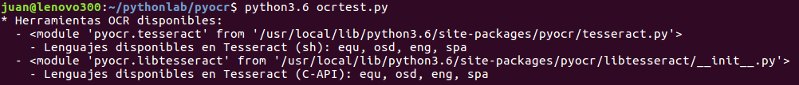
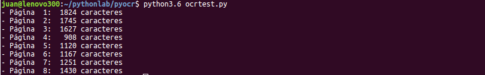
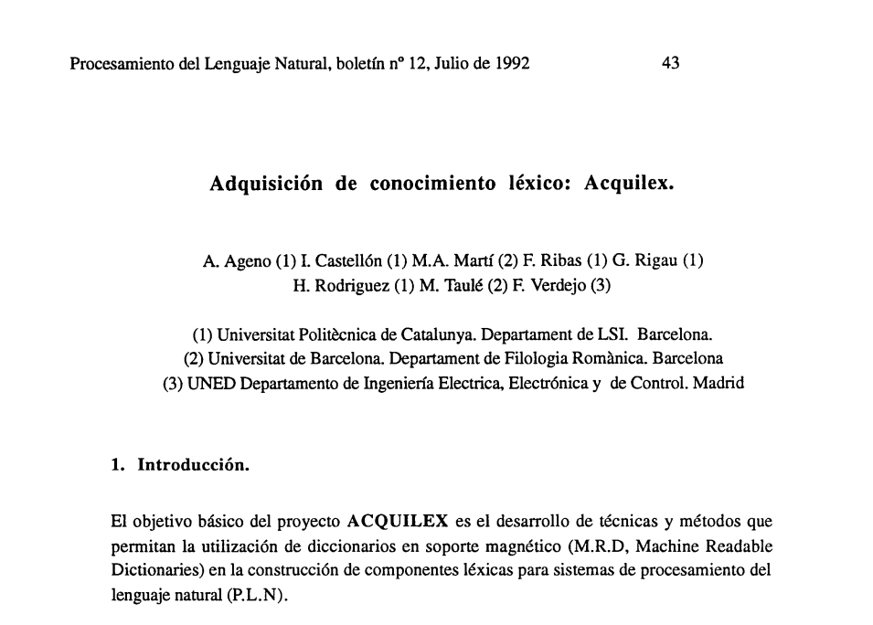
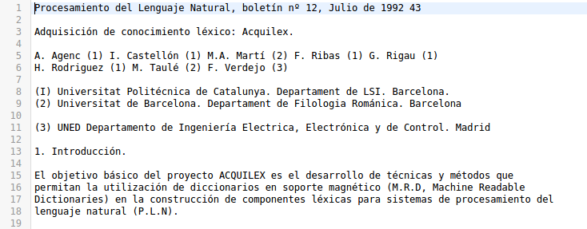

# OCR con Python


Hay gran cantidad de archivos **PDF que contienen imágenes en lugar de texto** y en ocasiones podemos **necesitar extraerlo** para interactuar con él mediante programas de edición de texto o cualquier otro proceso de tratamiento de información.

La disciplina tecnológica que trata estos temas es conocida por sus siglas en inglés **OCR** (Optical Character Recognition) cuya traducción al castellano es **Reconocimiento Óptico de Caracteres** (ROC). El reconocimiento óptico de caracteres es un proceso dirigido a la identificación automática de textos a partir de imágenes de símbolos o caracteres pertenecientes a un determinado alfabeto, para después almacenarlos en forma de texto.

Hay que tener muy presente que, por regla general, **la extracción de texto desde imágenes puede generar muchos errores tipográficos**. Por ello, y según el objetivo marcado, es muy probable que tengamos que realizar varias pruebas con diferentes herramientas y configuraciones para dar con la solución más acertada a nuestras necesidades.

## Python, Tesseract y pyocr

Podemos incorporar el tratamiento OCR en nuestras herramientas **Python** utilizando **Tesseract**, la biblioteca de OCR más famosa que existe, patrocinada por Google.

**Tesseract** se instala en el sistema operativo, pero la instalación por defecto sólo viene con algunos lenguajes: **equ**, **osd** y **eng**. Si necesitamos añadir algún lenguaje más, por ejemplo el español (**spa**), debemos instalarlo aparte. También tenemos opción de instalar todos los lenguajes disponibles (**all**).

> NOTA Puedes ver una lista de lenguajes en la siguiente url: https://askubuntu.com/questions/793634/how-do-i-install-a-new-language-pack-for-tesseract-on-16-04

En Python hay varias librerías que nos permiten interactuar con Tesseract, como **textract**, **pytesseract** o **pyocr**. Aunque las dos primeras son dos buenas bibliotecas, vamos a utilizar en esta ocasión **pyocr**, ya que viene con muchas funciones: se puede configurar para reconocer frases, palabras, dígitos, etc., puede usar Tesseract o Cuneiform, detecta la orientación del texto y mucho más.

Hacer OCR en una imagen es muy fácil, el problema surge cuando tenemos que hacerlo sobre un documento PDF. Por ello necesitaremos además algunas librerías adicionales, como **wand**, para convertir archivos PDF a imágenes. Por otro lado, **pyocr** también tiene dependencias con la librería **pillow**. 

## Entorno de trabajo

Para preparar nuestro entorno de trabajo necesitaremos, además de Python:
- Instalar la herramienta **Tesseract**, añadiendo además el lenguaje español (**spa**).
- Instalar las librerías Python: **pyocr**, **wand** y **pillow**.

Abrimos un terminal en nuestra máquina Ubuntu (16.04) y ejecutamos los siguientes comandos:

```
# Instalar Tesseract (tesseract-ocr-all instala todos los lenguajes)
sudo apt-get install tesseract-ocr 
sudo apt-get install tesseract-ocr-spa

# Instalar la librería PyOcr
pip install pyocr

# Instalar la librería Wand
pip install wand

# Instalar la librería Pillow
pip install pillow
```

## Script ocrtest.py

Ahora vamos a crear un pequeño script Python que reciba un fichero PDF como entrada y nos genere un fichero TXT a la salida.

En nuestro editor preferido crearemos un nuevo fichero, al que llamaremos **ocrtest.py**, y comenzaremos por añadirle la cabecera y las libreras:
```
#! /usr/bin/env python3
# -*- coding: utf-8 -*-

### Importamos las librerías
from wand.image import Image
from PIL import Image as PI
import pyocr
import pyocr.builders
import io
import sys
```

A continuación crearemos un método **show\_config()** que nos permitirá comprobar las bibliotecas OCR y los lenguajes disponibles en nuestro sistema. Ejecutaremos una vez el script llamando a dicha función para que nos muestre la información y podamos elegir la que nos interese. Después la asignaremos directamente en el script para que tome esos valores de configuración en las siguientes ejecuciones del mismo:

```
def show_config():
    tools = pyocr.get_available_tools()
    if len(tools) == 0:
        print("Herramienta OCR o encontrada.")
        sys.exit(1)
    print("* Herramientas OCR disponibles en %s:", tool.get_module())
    for tool in tools:
        print('  - %s' % tool)
        langs = tool.get_available_languages()
        print("    - Lenguajes disponibles: %s" % ", ".join(langs))

show_config()
```

Ejecutamos el script que tenemos hasta ahora, formado por las dos seciones de código anteriores, y en mi máquina da el siguiente resultado:



Como podemos ver, mi sistema dispone de dos versiones de la herramienta OCR Tesseract y 4 lenguajes. Voy a seleccionar la primera herramienta (0) y el lenguaje español (spa), comentando previamente la llamada al método **show\_config()**:
```
#show_config()

tool = pyocr.get_available_tools()[0]
lang = 'spa'
```

Ahora incorporaremos al script la sección del código que permite cargar en memoria un fichero PDF y, utilizando la librería wand, convertir cada una de sus páginas en una imagen JPEG. Como se intuye en el código, podemos variar los valores de resolución (300) y tipo de fichero (jpeg) para probar diferentes configuraciones:
```
### Cargamos el fichero PDF y convertimos cada una de sus páginas en una imagen JPEG (objeto blob)
image_pdf = Image(filename="jpegfile.pdf", resolution=300)
image_jpeg = image_pdf.convert('jpeg')
```

Después guardamos en un array las imágenes de cada página como objeto BLOB:
```
### Guardamos todas las imágenes en un array
page_jpeg_list = []
for img in image_jpeg.sequence:
    img_page = Image(image=img)
    page_jpeg_list.append(img_page.make_blob('jpeg'))
```

Ahora es el momento de recorrer el array de imágenes para extraer el texto de cada una de ellas aplicando OCR. El texto de cada página lo iremos añadiendo a una lista:
```
### Recorremos el array de imágenes y extraemos el texto de cada una de ellas aplicando OCR
page_text_list = []
for img in page_jpeg_list: 
    text = tool.image_to_string(PI.open(io.BytesIO(img)), lang=lang, builder=pyocr.builders.TextBuilder())
    page_text_list.append(text)
    print('- Página %2s: %5s caracteres' % (len(page_text_list), len(text)))
```

Por último, guardamos el texto completo en un fichero de texto:
```
### Guardamos el texto en un fichero:    
fp = open('textfile.txt', 'w')
fp.write('\n\n'.join(page_text_list))
fp.close()
```

## Probando el script ocrtest.py

Para la prueba final he elegido (... al azar) un fichero PDF, al que he llamado jpegfile.pdf, que corresponde a un documento de 1992 sobre el proyecto ACQUILEX y la adquisición de conocimiento léxico.

Ahora que ya tenemos todo dispuesto para ejecutar nuestra prueba (el script y el fichero PDF), podemos ejecutar por consola el comando siguiente:

```
python3.6 ocrtest.py
```

La ejecución del script muestra por pantalla el siguiente log:



Aquí os dejo una imagen del inicio de la primera página del fichero PDF original:



Y aquí el correspondiente texto extraído mediante OCR con nuestro script:



## Referencias y más información

- OCR:
    - [Reconocimiento óptico de caracteres](https://es.wikipedia.org/wiki/Reconocimiento_%C3%B3ptico_de_caracteres)

- Tesseract OCR:
    - [Tesseract OCR: Installation and Usage on Ubuntu 16.04](https://www.howtoforge.com/tutorial/tesseract-ocr-installation-and-usage-on-ubuntu-16-04/)

- Librería pyocr:
    - [pytesseract](https://pypi.python.org/pypi/pyocr)

- Librería wand:
    - [Librería wand (wand-py.org)](http://docs.wand-py.org/en/0.4.4/)
    - [Librería wand (pypi.python.org)](https://pypi.python.org/pypi/Wand)
    - [Wand Documentation Release 0.4.5](https://media.readthedocs.org/pdf/wand/latest/wand.pdf)

- Otros:
    - [OCR on PDF files using Python](https://pythontips.com/2016/02/25/ocr-on-pdf-files-using-python/)
    - [Python: OCR for PDF or Compare textract, pytesseract, and pyocr](https://medium.com/@winston.smith.spb/python-ocr-for-pdf-or-compare-textract-pytesseract-and-pyocr-acb19122f38c)
    - [Tesseract OCR: Installation and Usage on Ubuntu 16.04](https://www.howtoforge.com/tutorial/tesseract-ocr-installation-and-usage-on-ubuntu-16-04/)

- Librería textract:
    - [textract](https://textract.readthedocs.io/en/stable/)

- Librería pytesseract:
    - [pytesseract](https://pypi.python.org/pypi/pytesseract)

